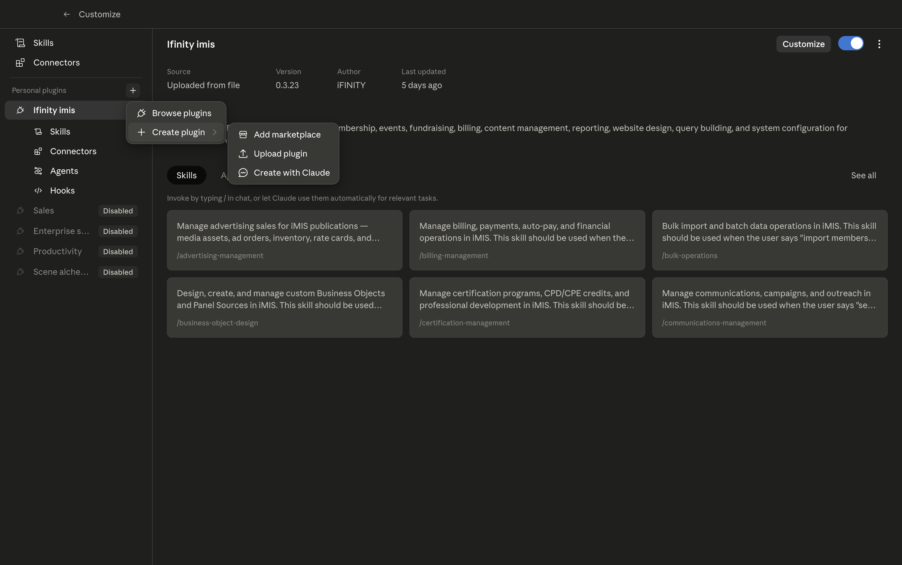
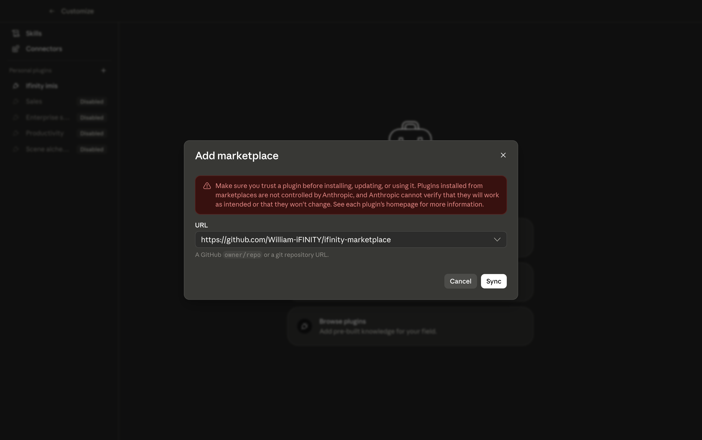
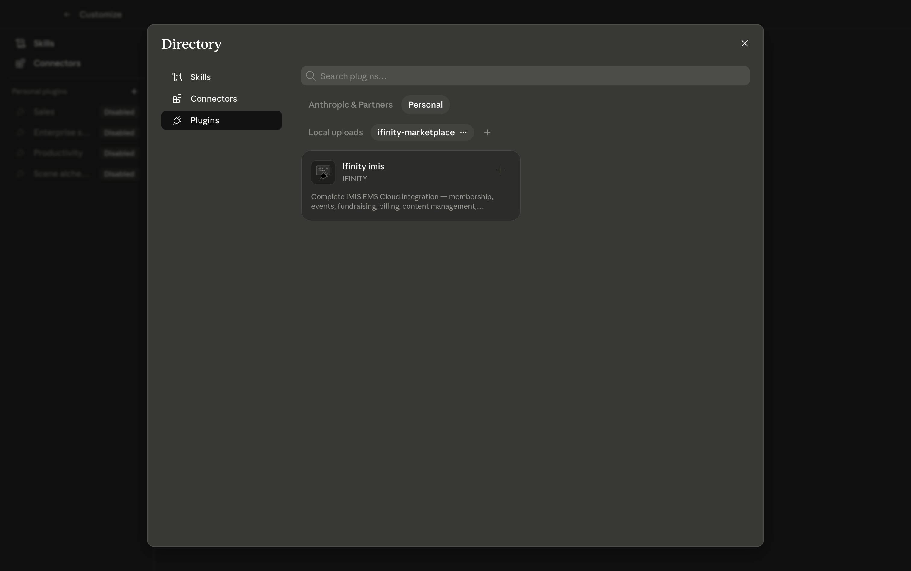
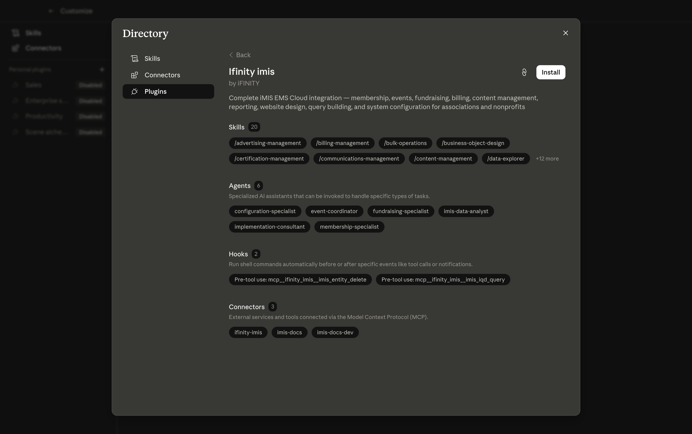

# iFINITY Marketplace

Claude Code plugin marketplace for iFINITY products.

## Install in Cowork or Claude Desktop

### Step 1 — Open the plugin directory

In Claude, click **Customize** then click the **+** button next to Personal plugins. Select **Add marketplace**.



### Step 2 — Add the iFINITY marketplace

Enter the marketplace URL and click **Sync**:

```
https://github.com/William-iFINITY/ifinity-marketplace
```



### Step 3 — Find the plugin

Click **Browse plugins**, then select the **Personal** tab. The iFINITY marketplace appears as a source. Click the **Ifinity imis** plugin card.



### Step 4 — Review and install

The plugin detail page shows everything included — 20 skills, 6 specialist agents, 2 safety hooks, and 3 connectors. Click **Install**.



### Step 5 — Connect to iMIS

Open the **iFINITY AgentZ** desktop app and sign in to your iMIS instance. AgentZ acquires an access token and pushes it to the plugin automatically. Verify the connection by asking Claude:

> "Check iMIS connection status"

## Install via Claude Code CLI

```bash
claude plugin marketplace add William-iFINITY/ifinity-marketplace
claude plugin install ifinity-imis@ifinity
```

## Install via iFINITY AgentZ

Open AgentZ, go to **Settings > Agent Plugin — Claude Code**, and click **Install Plugin**. AgentZ handles marketplace registration, installation, and updates automatically.

## Plugins

| Plugin | Description |
|--------|-------------|
| [ifinity-imis](plugins/ifinity-imis/) | iMIS EMS Cloud integration — membership, events, fundraising, billing, content management, reporting, website design, query building, and system configuration |

## Source

Plugin source code lives in [ifinity-mcp](https://github.com/William-iFINITY/ifinity-mcp). This marketplace repo contains only release distributions, updated automatically by the release workflow.
